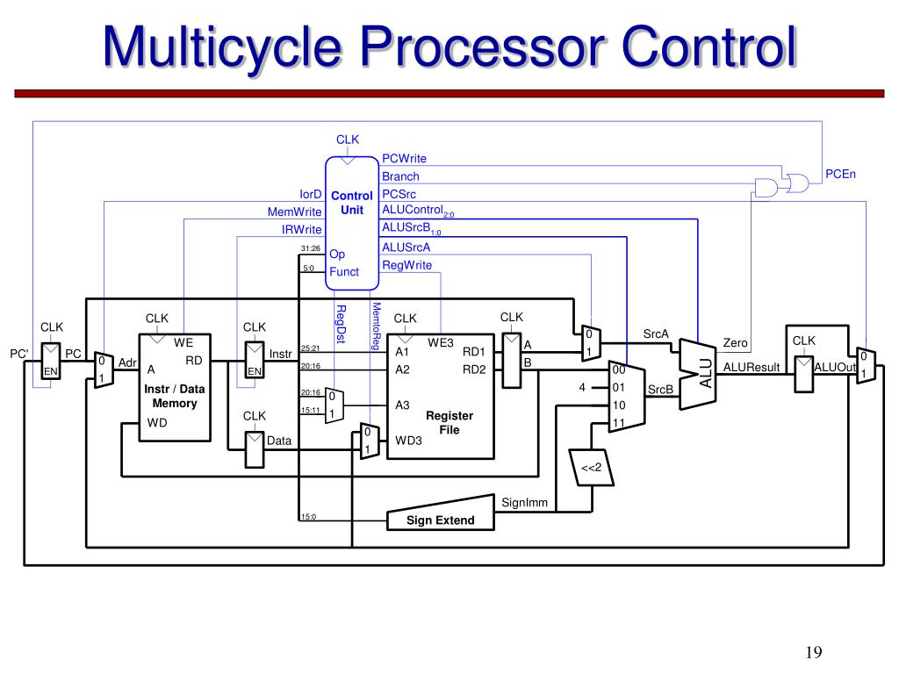

# Multi-Cycle CPU

An autonomous 32-bit Multi-Cycle RISC Processor implementation featuring a Finite State Machine (FSM) control unit, based on Chapter 7 of *Digital Design and Computer Architecture* by David Harris & Sarah Harris.



---

## Overview

Unlike the single-cycle design, the Multi-Cycle CPU breaks instruction execution into multiple shorter clock cycles. Functional units—such as the ALU and Memory—are reused across different cycles within the same instruction execution, significantly reducing hardware resource requirements and allowing a much faster clock frequency.

- **Instruction Width**: 32-bit
- **Data Path Width**: 32-bit
- **Unified Memory**: A single shared memory module handles both instructions and data.
- **Shared ALU**: A single ALU performs PC increments, address calculations, branch target arithmetic, and general computations.
- **Variable CPI**: Instructions take between **3 and 5 clock cycles** depending on complexity.

---

## Architectural State Registers

Because an instruction spans several clock cycles, intermediate values must be latched into non-architectural temporary registers:

| Register | Name | Purpose |
|:---|:---|:---|
| **IR** | `InstructionRegister` | Latches the fetched instruction word during the Fetch cycle for decoding throughout subsequent cycles. |
| **MDR** | `MemoryDataRegister` | Buffers data read from memory on load instructions (`LW`) before writing into the register file. |
| **A** | `OperandA_reg` | Latches source register value 1 (`rs1`) from the register file. |
| **B** | `OperandB_reg` | Latches source register value 2 (`rs2`) from the register file (used as ALU input or memory store data). |
| **ALUOut** | `ALU_out_reg` | Latches the ALU output value to hold computed addresses or arithmetic results for the next cycle. |

---

## FSM Controller State Diagram

The heart of the Multi-Cycle CPU is the **FSM Control Unit** (`FSMControlUnit`), navigating through the following state machine:

```
                      +-------------------+
                      |      FETCH        | (Cycle 1: IR = Mem[PC], PC = PC + 1)
                      +-------------------+
                                |
                                v
                      +-------------------+
                      |      DECODE       | (Cycle 2: A = Reg[rs1], B = Reg[rs2], ALUOut = PC + imm)
                      +-------------------+
                                |
         +----------------------+----------------------+----------------------+
         | (R-type / I-type)    | (LW / SW)            | (BEQ / BNE)          | (J)
         v                      v                      v                      v
  +--------------+       +--------------+       +--------------+       +--------------+
  |   EXECUTE    |       |   MEM_ADDR   |       |    BRANCH    |       |     JUMP     |
  +--------------+       +--------------+       +--------------+       +--------------+
         |                      |                      |                      |
         v               +------+------+               v                      v
  +--------------+       |             |            (FETCH)                (FETCH)
  | ALU_WRITEBACK|       v             v
  +--------------+  +----------+ +----------+
         |          | MEM_READ | | MEM_WRITE|
         v          +----------+ +----------+
      (FETCH)            |             |
                         v             v
                    +----------+    (FETCH)
                    | MEM_WB   |
                    +----------+
                         |
                         v
                      (FETCH)
```

### Execution Steps by Instruction Class

1. **Cycle 1: FETCH (All instructions)**
   - Read instruction from unified memory at `PC`: `IR = Memory[PC]`
   - Increment PC using the shared ALU: `PC = PC + 1`
2. **Cycle 2: DECODE (All instructions)**
   - Read register file operands: `A = Reg[rs1]`, `B = Reg[rs2]`
   - Precompute branch target using shared ALU: `ALUOut = PC + immediate`
3. **Cycle 3: EXECUTE / MEM_ADDR / BRANCH / JUMP**
   - **R-type / I-type**: `ALUOut = A op B` (or `A op imm`) -> transition to `ALU_WRITEBACK`.
   - **Memory (`LW`/`SW`)**: `ALUOut = A + imm` -> transition to `MEM_READ` or `MEM_WRITE`.
   - **Branch (`BEQ`/`BNE`)**: Compare `A` and `B` with ALU (`SUB`). If condition met: `PC = ALUOut` -> return to `FETCH`.
   - **Jump (`J`)**: `PC = immediate` -> return to `FETCH`.
4. **Cycle 4: MEM_READ / MEM_WRITE / ALU_WRITEBACK**
   - **ALU_WRITEBACK**: `Reg[rd] = ALUOut` -> return to `FETCH`.
   - **MEM_WRITE (`SW`)**: `Memory[ALUOut] = B` -> return to `FETCH`.
   - **MEM_READ (`LW`)**: `MDR = Memory[ALUOut]` -> transition to `MEM_WB`.
5. **Cycle 5: MEM_WB (`LW` only)**
   - `Reg[rd] = MDR` -> return to `FETCH`.

---

## Cycles Per Instruction (CPI) Summary

| Instruction Class | Path Through FSM | Cycles |
|:---|:---|:---:|
| `BEQ`, `BNE` (Branch) | FETCH -> DECODE -> BRANCH | **3** |
| `J` (Jump) | FETCH -> DECODE -> JUMP | **3** |
| R-type (`ADD`, `SUB`, etc.) | FETCH -> DECODE -> EXECUTE -> ALU_WB | **4** |
| I-type (`ADDI`, `LI`) | FETCH -> DECODE -> EXECUTE -> ALU_WB | **4** |
| `SW` (Store Word) | FETCH -> DECODE -> MEM_ADDR -> MEM_WRITE | **4** |
| `LW` (Load Word) | FETCH -> DECODE -> MEM_ADDR -> MEM_READ -> MEM_WB | **5** |

**Average CPI**: Typically ~4.0 depending on program instruction mix.

---

## Key Advantages Over Single-Cycle

1. **Hardware Efficiency**: Unified memory (instead of separate instruction and data memories) and a single shared ALU (no separate PC incrementers or branch adders).
2. **Shorter Cycle Time**: Clock period is governed only by the single longest functional unit (e.g. Memory access or ALU latency) rather than the sum of all units.
3. **Variable Timing**: Fast instructions (like branches and stores) complete in 3–4 cycles without waiting for the 5-cycle worst case needed by loads.
