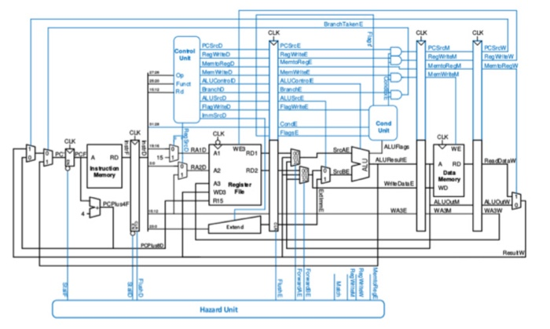

# 5-Stage Pipelined CPU

A high-performance 32-bit 5-stage Pipelined Processor implementation featuring full data forwarding, load-use hazard stall insertion, and control hazard flushes, based on Chapter 7 of *Digital Design and Computer Architecture* by David Harris & Sarah Harris.



---

## Overview

Pipelining overlaps the execution of multiple instructions simultaneously. While one instruction is in Writeback, the next is accessing Memory, the third is executing in the ALU, the fourth is being decoded, and the fifth is being fetched.

- **Instruction Width**: 32-bit
- **Pipeline Depth**: 5 Stages (`IF`, `ID`, `EX`, `MEM`, `WB`)
- **Target Throughput**: Near **1 instruction per clock cycle** ($CPI \approx 1.0$), with the clock frequency of a single stage.
- **Hazard Handling**:
  - **Data Hazards (RAW)**: Resolved with **MEM -> EX** and **WB -> EX** ALU forwarding, plus **WB -> ID** register file bypass.
  - **Load-Use Hazards**: Detected by `HazardUnit`; resolves by stalling `IF` and `ID` for 1 cycle while inserting an `EX` flush (bubble).
  - **Control Hazards**: Conditional branches (`BEQ`, `BNE`) and jumps (`J`) evaluate in `EX`; on a taken branch, `IF/ID` and `ID/EX` are flushed (2-cycle branch penalty).

---

## The 5 Pipeline Stages

```
 +----+       +----+       +----+       +----+       +----+
 | IF | ----> | ID | ----> | EX | ----> |MEM | ----> | WB |
 +----+       +----+       +----+       +----+       +----+
 Fetch        Decode       Execute      Memory       Writeback
 PC+1         RegRead      ALU op       DataMem      RegWrite
              Bypass       Forwarding   Read/Write   Mux Out
```

### 1. Instruction Fetch (IF)
- Drives `PC` to Instruction Memory.
- Computes `PC + 1` via `pc_adder_`.
- Multiplexes next PC from `PC + 1`, branch target from EX (`branch_target_e`), or WB register destination.
- Pipeline Register: **`IF_ID`** stores fetched instruction and `PC + 1`.

### 2. Instruction Decode & Operand Read (ID)
- Decodes instruction fields using `InstructionDecoder`.
- Reads operands from `RegisterFile` (`rd1_data`, `rd2_data`).
- Includes **WB-to-ID register bypass**: If WB stage writes to register `rd` in the same cycle ID stage reads `rs1` or `rs2`, the new write value is forwarded immediately.
- Pipeline Register: **`ID_EX`** stores operands, sign-extended immediate, register addresses (`rs1`, `rs2`, `rd`), and stage control signals.

### 3. Execute & Address Calculation (EX)
- Evaluates forwarding multiplexers (`ForwardAE_mux`, `ForwardBE_mux`):
  - `00`: Forward from ID/EX register (no hazard).
  - `10`: Forward from EX/MEM stage (ALUOutM).
  - `01`: Forward from MEM/WB stage (ResultW).
- Selects second operand between forwarded `write_data` and immediate.
- Evaluates ALU operation (`ALUInterface`).
- Computes branch target: `branch_target_e = (PC + 1) + immediate`.
- Resolves branch condition (`BEQ`, `BNE`, `J`).
- Pipeline Register: **`EX_MEM`** stores ALU result, forwarded write data, destination register address, and MEM/WB control signals.

### 4. Memory Access (MEM)
- Accesses Data Memory using the ALU result as address.
- Performs `LW` (memory read) or `SW` (memory write).
- Pipeline Register: **`MEM_WB`** stores memory read data, ALU result, and destination register address.

### 5. Writeback (WB)
- `WriteBackMux` selects between Data Memory read data (`LW`) and ALU result.
- Drives write port of `RegisterFile` on the rising clock edge if `reg_write` is enabled.

---

## Hazard Detection & Forwarding Unit

The **`HazardUnit`** monitors register addresses across all active pipeline stages to dynamically resolve dependencies:

### 1. Data Forwarding (RAW Hazards)
When an instruction depends on a value produced by an earlier instruction still in the pipeline:
- **MEM -> EX Forwarding**: If `reg_write_m` is active and `wa3_m == ra1_e` (or `ra2_e`), `ForwardAE` (or `ForwardBE`) is set to `10`.
- **WB -> EX Forwarding**: If `reg_write_w` is active and `wa3_w == ra1_e` (or `ra2_e`), `ForwardAE` (or `ForwardBE`) is set to `01`.

### 2. Load-Use Hazard Stall
A load instruction (`LW`) does not receive data from memory until the end of the `MEM` stage. When the immediately following instruction in `ID` requires that data:
$$\text{Condition: } mem\_to\_reg\_e \text{ and } (wa3\_e == ra1\_d \lor wa3\_e == ra2\_d)$$
- `stall_f = HIGH`: Freezes Program Counter (`PC`).
- `stall_d = HIGH`: Freezes `IF/ID` register.
- `flush_e = HIGH`: Inserts a `NOP` bubble into `ID/EX`.

### 3. Control Hazard (Branch Flush)
Branches resolve in the `EX` stage. If a branch is taken:
- `flush_d = HIGH`: Flushes `IF/ID` register (discards speculatively fetched instruction).
- `flush_e = HIGH`: Flushes `ID/EX` register (discards speculatively decoded instruction).
- `PC` loads `branch_target_e`.
- Incurs a **2-cycle branch penalty**.

---

## Microarchitectural Comparison

| Metric | Single-Cycle | Multi-Cycle | Pipelined |
|:---|:---:|:---:|:---:|
| **CPI (Ideal)** | 1.0 | 3.0 – 5.0 | **1.0** |
| **Clock Frequency** | Low | High | **High** |
| **Throughput** | 1 instr / long cycle | 1 instr / 4 short cycles | **1 instr / short cycle** |
| **Hardware Complexity** | Minimal | Low (shared ALU/Mem) | Higher (registers, hazard logic) |
| **Hazard Resolution** | None needed | None needed | Forwarding + Stalls + Flushes |
