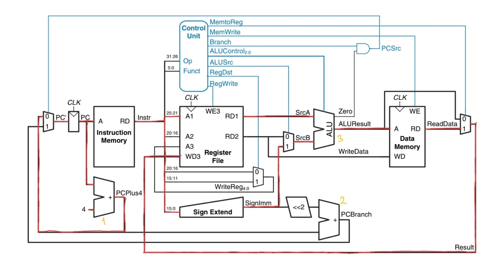

# Single-Cycle CPU

A complete 32-bit Single-Cycle RISC Processor implementation based on Chapter 7 (*Microarchitecture*) of *Digital Design and Computer Architecture* by David Harris & Sarah Harris.



---

## Overview

The Single-Cycle CPU executes each instruction in a **single clock cycle**. Every instruction begins on a clock edge and completes all execution stages i.e Instruction Fetch, Decode, Register Read, ALU Operation, Memory Access, and Register Writeback, before the next clock edge arrives.

- **Instruction Width**: 32-bit
- **Data Path Width**: 32-bit
- **Registers**: 16 General-Purpose Registers (`R0`–`R15`), where `R0` is typically zero.
- **Cycles Per Instruction (CPI)**: Strictly **1.0** (every non-halt instruction takes exactly 1 clock cycle).
- **Addressing**: Word-addressed instruction memory and data memory.

---

## Architecture & Datapath Stages

Although executed within one continuous clock period, the datapath logically flows through five combinational phases:

```
[ PC ] ---> [ Instruction Memory ] ---> [ Instruction Decoder & Control Unit ]
                                                     |
                                                     v
                                            [ Register File ]
                                            /               \
                                      [ Read Data 1 ]    [ Read Data 2 ]
                                            |               |  (or Immediate)
                                            v               v
                                            [      ALU      ]
                                                    |
                                      +-------------+-------------+
                                      |                           |
                                      v                           v
                              [ Data Memory ]            [ ALU Direct Out ]
                                      |                           |
                                      +-------------> [ Mux ] <---+
                                                        |
                                                        v
                                             [ Write Back to Reg ]
```

### 1. Instruction Fetch (IF)
- **Program Counter (`ProgramCounter`)**: Holds the current 32-bit instruction address. Updated every clock cycle when `pc_enable` is HIGH.
- **Instruction Memory (`InstructionMemory`)**: Asynchronously outputs the 32-bit instruction word pointed to by `PC`.
- **PC Adder (`pc_adder_`)**: Increments the current PC by 1 word (`PC + 1`) for sequential execution.

### 2. Instruction Decode & Control (ID)
- **Instruction Decoder (`InstructionDecoder`)**: Deconstructs the 32-bit instruction word into opcode, source registers (`rs1`, `rs2`), destination register (`rd`), and sign-extended immediate fields based on format (R, I, S, B, J).
- **Control Unit (`ControlUnit`)**: Purely combinational logic decoding the opcode into control lines:
  - `register_write`: Enables writing to the destination register.
  - `alu_source_immediate`: Selects between register operand 2 and immediate value.
  - `alu_operation`: Configures ALU operation (`ADD`, `SUB`, `AND`, `OR`, `XOR`, `NOT`, `PASS_A`, `PASS_B`).
  - `memory_read` / `memory_write`: Controls data memory access.
  - `branch` / `jump`: Controls PC next multiplexer.
  - `halt`: Disables PC increment and freezes processor state.

### 3. Execution (EX)
- **ALU Operand Mux (`ALUOperandMux`)**: Multiplexes between `RD2` (register data) and the sign-extended immediate.
- **ALU Interface (`ALUInterface`)**: Computes the result and produces status flags (`alu_zero`, `alu_carry`).
- **Branch Target Adder (`branch_adder_`)**: Computes the branch target address (`PC + immediate`).

### 4. Memory Access (MEM)
- **Data Memory (`DataMemory`)**: Split memory space (ROM in lower half, RAM in upper half >= 0x80).
  - `LW`: Reads 32-bit word from RAM address computed by ALU.
  - `SW`: Writes `RD2` data into RAM address on the clock edge.

### 5. Writeback (WB)
- **WriteBack Mux (`WriteBackMux`)**: Selects between the ALU result (arithmetic/logical instructions) and Data Memory read data (`LW`).
- **Register File (`RegisterFile`)**: Latches write data into destination register `rd` on the rising clock edge if `register_write` is enabled.

---

## Control Signals Truth Table

| Instruction | Format | `reg_write` | `alu_src_imm` | `alu_op` | `mem_read` | `mem_write` | `branch` | `jump` | `halt` |
|:---|:---:|:---:|:---:|:---:|:---:|:---:|:---:|:---:|:---:|
| `ADD` / `SUB` | R | 1 | 0 | ADD / SUB | 0 | 0 | 0 | 0 | 0 |
| `AND` / `OR` / `XOR` | R | 1 | 0 | AND / OR / XOR | 0 | 0 | 0 | 0 | 0 |
| `NOT` | R | 1 | 0 | NOT | 0 | 0 | 0 | 0 | 0 |
| `LI` | I | 1 | 1 | PASS_B | 0 | 0 | 0 | 0 | 0 |
| `ADDI` | I | 1 | 1 | ADD | 0 | 0 | 0 | 0 | 0 |
| `LW` | I | 1 | 1 | ADD | 1 | 0 | 0 | 0 | 0 |
| `SW` | S | 0 | 1 | ADD | 0 | 1 | 0 | 0 | 0 |
| `BEQ` / `BNE` | B | 0 | 0 | SUB | 0 | 0 | 1 | 0 | 0 |
| `J` | J | 0 | 0 | ADD | 0 | 0 | 0 | 1 | 0 |
| `HALT` | I | 0 | 0 | NOP | 0 | 0 | 0 | 0 | 1 |

---


